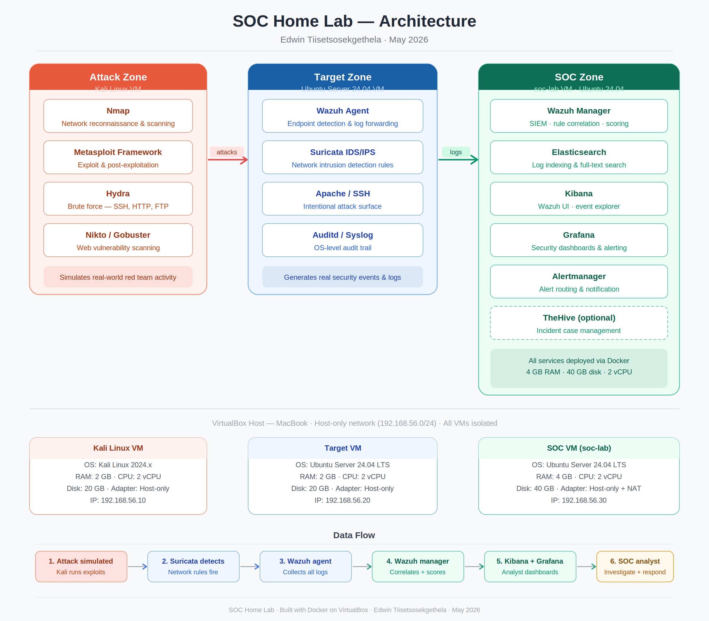

# SOC Home Lab

A self-contained Security Operations Centre environment built on VirtualBox, simulating real-world attack detection with Wazuh (SIEM), Suricata (network IDS), and real-time Telegram alerting — mapped against the MITRE ATT&CK framework.

## What this is

A three-zone lab — attack, target, and SOC — built to practice the full security operations workflow: simulate an attack, detect it, correlate it against MITRE ATT&CK, and get notified in real time. Everything runs on open-source tooling used in production SOC environments.

| | |
|---|---|
| **SIEM** | Wazuh 4.7.3 (Docker, single-node) |
| **Network IDS** | Suricata 8.0.3 |
| **Alerting** | Telegram Bot API |
| **Attack tooling** | Nmap, Hydra, Metasploit |
| **Host platform** | VirtualBox on macOS |

## Architecture

Three isolated VMs on a host-only `192.168.56.0/24` network:

| Zone | VM | Role |
|---|---|---|
| 🔴 Attack | `kali-lab` | Red team — Nmap recon, Hydra brute force, Metasploit |
| 🔵 Target | `target-lab` | Victim — Apache/SSH attack surface, Wazuh agent, Suricata IDS |
| 🟢 SOC | `soc-lab` | Blue team — Wazuh Manager, Indexer, Dashboard (Docker) |

**Data flow:** attack simulated → Suricata detects → Wazuh agent collects → Wazuh manager correlates + maps to MITRE ATT&CK → dashboard surfaces it → Telegram notifies the analyst in real time.

Full diagram and VM specs: [`docs/01-architecture-and-overview.pdf`](docs/01-architecture-and-overview.pdf)

## What it demonstrates

- **Real-time detection** — SSH brute force and Nmap scans detected and alerted on with zero manual rule configuration
- **MITRE ATT&CK mapping** — detected events automatically mapped to techniques (T1110 Brute Force, T1078 Valid Accounts, T1021 Remote Services, and others)
- **End-to-end alerting pipeline** — Wazuh → custom Python integration → Telegram, verified with live tests
- **Network-level IDS** — custom Suricata rule authored and deployed to catch Nmap SYN scans
- **Real troubleshooting** — six actual build issues hit and resolved, documented with root cause analysis (not a sanitized "it just worked" writeup)

## Documentation

| Doc | Covers |
|---|---|
| [`01-architecture-and-overview.pdf`](docs/01-architecture-and-overview.pdf) | Full architecture, tech stack, VM layout, data flow |
| [`02-attack-simulation-and-detection.pdf`](docs/02-attack-simulation-and-detection.pdf) | Build steps, Nmap/Hydra attack execution, MITRE ATT&CK mapping, findings |
| [`03-siem-and-alerting-build.pdf`](docs/03-siem-and-alerting-build.pdf) | Wazuh Docker deployment, Suricata rule authoring, Telegram alert pipeline, verification |
| [`04-troubleshooting-log.pdf`](docs/04-troubleshooting-log.pdf) | Six real issues encountered and resolved during the build |

## Screenshots

See [`screenshots/`](screenshots/) — organized by component:

- [`architecture/`](screenshots/architecture/) — system diagram
- [`wazuh/`](screenshots/wazuh/) — dashboard, alerts, agent status
- [`suricata/`](screenshots/suricata/) — IDS rule hits, logs
- [`attack-simulation/`](screenshots/attack-simulation/) — Nmap/Hydra execution and output
- [`alerts/`](screenshots/alerts/) — Telegram notifications in action

## Results snapshot

| Metric | Before attacks | After attacks |
|---|---|---|
| Total alerts | 0 | 475 |
| Authentication failures | 0 | 113 |
| MITRE techniques mapped | — | 5 |

## Status & next steps

**Phase 1: Complete.** Planned additions: TheHive incident case management, Grafana security dashboards, and expanded attack scenarios (web application attacks, lateral movement simulation).

## Notes on this repo

This is a personal, self-funded learning project — not affiliated with any employer. Credentials, API tokens, and chat IDs referenced during the build have been redacted or rotated; none of the values in this repo are live. See the troubleshooting log for the one instance where a token was briefly exposed and how it was handled.

---

Built by [Edwin Sekgethela - LinkedIn](https://www.linkedin.com/in/edwin-tiisetso-sekgethela) while working toward CCNA and a career in network & security engineering.
